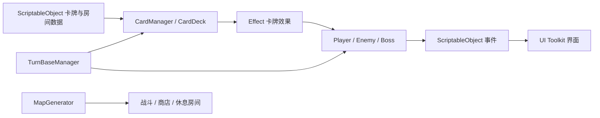

# 3D 卡牌游戏 · 核心代码展示

Unity / C# 卡牌项目，围绕卡组管理、回合战斗、房间地图和界面交互组织代码。

此仓库供作品集与代码阅读使用，展示 63 个核心 C# 脚本及 UI Toolkit 布局。完整场景、美术、音频、第三方插件和游戏成品保留在完整项目中；本展示版不能直接作为完整 Unity 游戏运行。

## 先看这些代码

| 模块 | 内容 | 入口 |
| --- | --- | --- |
| 卡牌与卡组 | 卡牌数据、资源异步加载、卡库管理、抽牌和弃牌 | [CardManager](Assets/Scripts/Manager/CardManager.cs)、[CardDeck](Assets/Scripts/Card/Mono/CardDeck.cs) |
| 回合战斗 | 回合推进、角色状态和卡牌效果 | [TurnBaseManager](Assets/Scripts/Manager/TurnBaseManager.cs)、[CharacterBase](Assets/Scripts/Character/CharacterBase.cs) |
| 卡牌效果 | 伤害、防御、抽牌、治疗和力量效果 | [Card Effect](<Assets/Scripts/Card Effect/>) |
| 地图与房间 | 房间分列生成、连接和布局复用 | [MapGenerator](Assets/Scripts/Room/MonoBehaviour/MapGenerator.cs) |
| 事件通信 | ScriptableObject 事件和事件监听器 | [Events](Assets/Scripts/Events/) |
| 对象复用 | 卡牌对象池和对象回收 | [PoolTool](Assets/Scripts/Utilities/PoolTool.cs) |
| 用户界面 | 手牌交互、菜单、商店、休息室、胜负界面 | [UI 控制器](Assets/Scripts/UI/)、[UXML / USS](Assets/UI/) |

## 技术结构

## 目录

- `Assets/Scripts/`：核心游戏逻辑；保留原有目录结构和 Unity `.meta` 文件。
- `Assets/UI/`：UI Toolkit 的 UXML 布局和 USS 样式。
- `Packages/`：完整项目记录的 Unity 包依赖，供阅读时参考。
- `ProjectSettings/ProjectVersion.txt`：完整项目记录的编辑器版本，Unity **2023.2.20f1**。

源码中仍有对 DOTween、Spine、Addressables 等依赖的引用。若要重建可运行工程，需要配置完整场景、资源、对象引用和相应依赖。

演示视频、原始报告和第三方素材包不在公开展示版中。

[返回 GitHub 项目主页](https://github.com/nocTia-O9)
